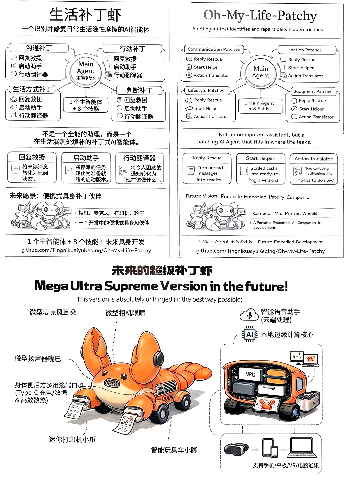
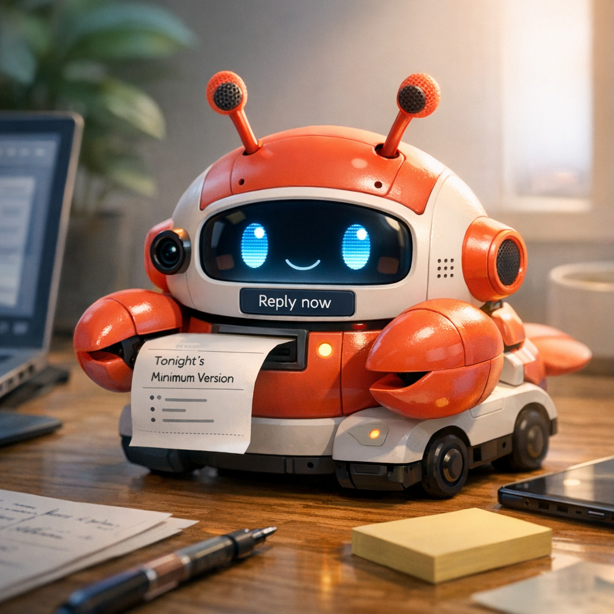

# Oh-My-Life-Patchy

> 一个专门识别并修复日常隐性损耗的 AI Agent  
> *An AI Agent that identifies and repairs daily hidden frictions.*


**当前版本为可运行的软件形态。**  
**成熟版可扩展为支持“听、说、读、写、走”的便携具身化生活补丁伙伴。**

---

## 想象这样一个场景

晚上 11:42。

你盯着一条还没回的消息、一份还没看懂的通知、和一个越来越近的 deadline，脑子已经开始乱了。

这时，桌上的小龙虾轻轻吐出一张纸条：

> 先别慌。  
> 我们先回复 Tina：  
> “不好意思刚刚没及时回你，我这边已经在处理了，晚一点我给你更完整的同步。”  
>
> 然后我先帮你解读一下这份通知：  
> “这件事和你有关系，但今晚最低只需要先完成 A 和 B，C 不是现在最急的。”  
>
> 关于那条该死的 deadline，  
> 我已经帮你起草了一个快速交付框架。  
> 你先把最低版本做完，  
> 如果还有时间，我再告诉你怎么把它优化得更漂亮。  
>
> 加油。💪

它不是来陪你聊天的。  
它是来帮你先把生活里已经漏出来的洞补上的。

这就是 **Oh-My-Life-Patchy**。

## 这个场景里，龙虾在做什么？

- **“一条还没回的消息” —— 回消息急救**
- **“一份还没看懂的通知” —— 行动翻译器**
- **“一个越来越近的 deadline” —— 起手代打**
- **“几件事同时压上来，脑子开始乱” —— 主 Agent 负责编排顺序**

---

## 它和普通聊天 AI 有什么区别？

### 1. 先识别问题类型，不直接泛泛回答
普通聊天 AI 往往是“你问什么，我答什么”。

Oh-My-Life-Patchy 会先判断你现在卡住的是哪一类问题：
- 回消息急救
- 起手代打
- 行动翻译器
- 协作补丁
- 未来减麻烦
- 后悔模拟器
- 退出机制
- 找东西推理

也就是说，它先判断你卡在哪，再决定怎么补。

### 2. 给的是可直接执行结果，不只是建议
它的重点不是告诉你“可以怎么做”，而是直接给你：
- 一条能发的消息
- 一个能开写的开头
- 一个今晚待办清单
- 一个最小推进框架
- 一个临近截止时的止损版本

它想解决的是：用户看完之后，能不能立刻做下一步。

### 3. 复杂场景里会先排优先级，再处理
现实里的问题经常不是一件，而是几件缠在一起。

比如：
- 队友来问进度了，但自己还没开始
- 通知也没看懂
- deadline 还快到了

普通聊天 AI 往往会把这些混在一起分析。

Oh-My-Life-Patchy 更强调顺序：
1. 先处理最容易继续恶化的部分
2. 先止损，再恢复推进
3. 先给最低可执行结果，再考虑优化

所以它更像一个会帮你补眼前这件事的 Agent，而不是只会泛泛聊天的助手。

---

## 在这个场景里，问题是如何被拆解并路由的？

这个场景看起来像一个“大麻烦”，  
但对 Oh-My-Life-Patchy 来说，它其实是几个**日常隐性损耗**叠在一起的复合场景。

### 1. “一条还没回的消息”
对应技能：**Reply Rescue（回消息急救）**

这里的核心不是“帮你写一句话”，而是：

- 先接住已经拖延的沟通
- 降低失礼和误判风险
- 给出一条可直接发送的补救型回复

它先修补的是**沟通损耗**。

### 2. “一份还没看懂的通知”
对应技能：**Action Translator（行动翻译器）**

这里的核心不是“把通知总结一下”，而是：

- 判断这件事和你有没有关系
- 区分现在必须做的、可以后做的、暂时不用管的
- 告诉你今晚最低该做什么
- 抓出最容易漏掉的时间点和格式坑

它修补的是**信息理解损耗**。

### 3. “一个越来越近的 deadline”
对应技能：**Start Helper（起手代打）**

这里的核心不是“帮你做完全部任务”，而是：

- 先给出一个最低可交付框架
- 让你从“脑子很乱”进入“先交出最低版本”
- 把完美主义压低，把启动门槛压低

它修补的是**行动损耗 / 启动困难**。

### 4. “几件事同时压上来，脑子开始乱”
对应能力：**Main Agent（主 Agent）**

真正的关键点在这里。

普通 AI 往往会把这个场景当成一个长问题来回答。  
而 Oh-My-Life-Patchy 的主 Agent 会先判断：

- 哪个问题最先止损？
- 哪个问题最容易继续恶化？
- 应该先补沟通，还是先补任务，还是先补理解？

所以它的处理顺序不是随机的，而是：

1. **先回复 Tina，止损沟通**
2. **再解读通知，明确最低要求**
3. **再起草快速交付框架，恢复推进**
4. **最后再考虑怎么优化**

这就是它和普通聊天助手的区别：

> 它不是把问题“回答一下”，  
> 而是把混乱拆开、排序、补洞、止损。

---

## 为什么它是“龙虾”，而不只是另一个 AI 助手？

很多 AI 也能回消息、写开头、总结通知。  
Oh-My-Life-Patchy 的差别不只在“会做什么”，而在于它**如何进入真实生活场景**。

普通 AI 往往要求用户先打开聊天框、整理问题、想清楚怎么问。  
而龙虾式 Agent 更强调：

- **捞现场**：把截图、通知、聊天记录、任务页面直接甩给它
- **先补丁**：先给一个能立刻用的版本，而不是先讲大道理
- **自动路由**：由主 Agent 判断这是哪类隐性损耗
- **进入生活流**：不是停留在聊天框里，而是进入你的消息、通知、任务、协作与截止场景

也就是说：

> **它不是“来问我一个问题”。**  
> **而是“把你眼前这个烂摊子捞给我，我来帮你补洞”。**

因此，Oh-My-Life-Patchy 更像一只 **现实介入型、补丁导向型的龙虾 Agent**，而不只是一个普通的对话助手。

---

## 它是什么？

**Oh-My-Life-Patchy = 一个专门识别并修复日常隐性损耗的 AI Agent。**

它不追求做一个无所不能的通用助手，也不试图管理你的整个人生。  
它只专注于那些：

- 不严重，但天天耗人
- 不复杂，但总会拖延
- 不致命，但持续偷走时间、注意力和体面感
- 不显眼，但真实影响效率、关系、行动和情绪稳定

比如：

- 消息看到了却迟迟不敢回
- 明知道该做什么，却迟迟起不了头
- 通知和规则看完了，还是不知道自己现在到底该做什么
- 协作时进度已经失真，却不知道怎么开口同步
- 临近截止，脑子很乱，不知道先救哪一步
- 一些小型生活摩擦持续打断你的节奏

它的核心职责是：

- 识别用户当前卡住的是哪类问题
- 路由到对应 skill
- 输出最小、即时、可执行的补丁方案
- 在复杂场景中完成多技能协同编排

它不强调“懂很多”，而强调：

- **补得准**
- **补得快**
- **补得能立刻用**

---

## 真正的创新点：从“提问式 AI”到“现场捞取式 AI”

如果只看功能名，很多能力听起来似乎并不陌生：

- 回消息
- 帮你起草开头
- 翻译通知
- 做行动清单

但 Oh-My-Life-Patchy 的关键创新，不只是“会做这些事”，而是：

## **它重新设计了 AI 进入生活场景的方式。**

它不是要求用户先想清楚 prompt，  
而是允许用户通过更贴近日常的入口直接“捞现场”，例如：

- 截一张聊天图
- 复制一段通知
- 转发一条消息
- 扔来一个作业要求
- 直接把混乱情况甩给龙虾

它更像：

- **捞消息** → 生成可直接发送的回复
- **捞通知** → 翻译成“你现在该做什么”
- **捞任务** → 输出能立刻开始的版本
- **捞混乱** → 给出止损与推进方案

所以它的创新不只是能力本身，而是：

> **如何被随时捞出来，进入真实生活流，快速补洞。**

---

## 项目结构

本项目采用：

# **1 个主 Agent + 8 个 Skills**

### 主 Agent
主 Agent 负责：

- 识别当前问题类型
- 路由到对应 skill
- 在复杂场景中做多技能协同编排

### 8 个 Skills

#### 沟通补丁
- **回消息急救**：处理已读未回、延迟回复、补救回复
- **体面表达**：处理催促、拒绝、改期、补救、重新联系
- **退出机制**：处理想退出、接不住、去不了、做不到的场景

#### 行动补丁
- **起手代打**：处理启动困难、开头困难、迟迟开始不了
- **未来减麻烦**：帮助用户用低成本动作减少未来的混乱和翻车

#### 判断补丁
- **行动翻译器**：把通知、规则、说明翻译成“你现在该做什么”
- **后悔模拟器**：在行动前预演短期后悔点，给出更稳妥方案

#### 生活补丁
- **找东西推理**：帮助用户更高效地找回常用物品，减少无序乱找

---

## 当前重点实现

当前版本重点实现了 3 个核心高频 skill：

### 1. 回消息急救
适用于：

- 消息拖着没回
- 越拖越不敢回
- 想补救回复
- 想礼貌拒绝、留余地表达

输出：

- 可直接发送的回复版本
- 更稳妥 / 更自然 / 更简洁的表达方案

### 2. 先起个头
适用于：

- 知道要做，但就是开始不了
- 题目有了，但标题、结构、开头都起不出来
- 截止临近，只想先启动一个最小版本

输出：

- 可直接开写的题目
- 最小结构
- 第一段草稿
- 最低交付线

### 3. 这通知啥意思
适用于：

- 通知看完还是不知道自己该干嘛
- 规则太长、条件太多、身份判断复杂
- 临近截止但优先级混乱

输出：

- 这和你有没有关系
- 现在必须做什么
- 最晚什么时候做完
- 最容易漏掉的坑
- 今天最小行动清单

---

## 主动性与现实入口：它如何遇见你的生活

Oh-My-Life-Patchy 不只是一个被动回答的对话工具。  
在龙虾式 Agent 的设想里，它更像一个**现实介入型补丁伙伴**。

### 1. 现场入口
它最自然的入口不是“先写 prompt”，而是：

- 截图一段聊天记录
- 复制一份通知
- 转发一条任务说明
- 把当前困境直接甩给龙虾

例如：

- **捞消息** → 生成一条可直接发送的回复
- **捞通知** → 翻译成“你现在该做什么”
- **捞任务** → 输出最低可开始版本
- **捞混乱** → 给出止损方案

### 2. 主动性
在 OpenClaw 的思路下，龙虾还可以通过两种机制体现主动性：

- **Heartbeat（心跳）**：适合周期性、上下文感知的检查与轻提醒，比如检查有没有临近截止的任务、有没有长期未回复的重要消息、有没有需要补上的小漏洞  
- **Cron / 定时任务**：适合精确时间、一次性提醒或固定报告，例如“每天早上 9 点发送补丁摘要”“20 分钟后提醒我开会”“每周固定时间做一次项目体检”

你也可以简单理解成：

- 想让龙虾 **一直帮你巡逻、轻提醒、看有没有地方漏了** → 更像 **heartbeat**
- 想让龙虾 **在某个精确时间提醒你、固定时间发东西** → 更像 **cron**

### 3. 渠道接入
未来它还可以进一步进入真实使用的消息环境，例如：

- 飞书
- Slack
- Telegram
- WhatsApp
- 其他日常沟通渠道

因此，龙虾和普通 AI 的差别不只是“会不会回答”，而是：

> **它能被随时捞出来，进入真实生活流，并在合适的时候主动补位。**

---

## 主 Agent 的复合场景能力

Oh-My-Life-Patchy 不只是单点工具，也支持复杂情境下的多技能协同。

例如在以下复合场景中：

- 协作对象已经来问进度，但自己还没开始
- 通知没完全看懂，任务要求也不明确
- 临近截止，时间有限，只能先止损
- 同时需要处理沟通、信息理解、启动困难

主 Agent 会优先按如下顺序处理：

1. 识别问题结构
2. 先生成状态同步消息
3. 再把要求翻译成最低交付线
4. 再给时间受限下的止损计划
5. 最后提醒最容易翻车的点

这也是它从“普通文本生成器”变成“救场型 Agent”的关键所在。

---

## 成熟版形态设想：便携具身化生活补丁玩偶

Oh-My-Life-Patchy 的成熟版不仅是一个软件 Agent，  
也可以扩展为一个可随身携带的 **具身化生活补丁终端**。

它支持：

- **听**：微型麦克风作为“耳朵”，在用户授权和可控开关前提下获取低侵入生活线索
- **看 / 读**：微型相机作为“眼睛”，感知简单环境、任务场景与现实对象
- **说**：微型扬声器作为“嘴巴”，主动提醒、播报补丁建议
- **写**：迷你打印机作为“手”，把“今晚最低完成版”“出门前清单”“待发送消息草稿”等关键补丁打印成实体纸条
- **走**：智能玩具车作为“脚”，让龙虾从桌面助手变成可移动的现实伙伴

其核心控制中枢可由 **微型电脑 + 便携电源 + 便携 Wi-Fi** 组成，支持与手机、电脑通讯，并内置龙虾主 Agent，使其从“屏幕里的 AI”进一步发展为“现实中的生活补丁伙伴”。

在成熟版形态中，它不仅可以通过聊天框理解你，也可以通过更贴近现实的入口“遇见你的生活”，例如：

- 截图你当前面对的聊天、通知、任务页面
- 通过手机或电脑的转发与分享入口快速接入现场
- 在用户授权和可控开关前提下，通过麦克风和摄像头获取低侵入生活线索
- 结合心跳巡查和定时任务，在合适的时候主动提醒、主动补位



---

## 为什么“写”这件事特别重要？

在所有具身化设想中，**迷你打印机** 是最契合 Oh-My-Life-Patchy 产品逻辑的一部分。

因为它输出的不是抽象建议，而是非常适合落到现实中的“补丁”：

- 今晚最低完成版
- 一条待发送的消息草稿
- 出门前检查清单
- 明天会感谢你的 3 个动作
- 两周计划骨架

把补丁打印出来，意味着它从“屏幕里的建议”变成了：

- 可以拿在手里
- 可以贴在桌上
- 可以带走
- 可以立刻照着做

这会让 Patchy 更像一个真正的生活伙伴，而不是又一个对话窗口。

---

## OpenClaw 部署方式

### 使用步骤

1. 安装好 **OpenClaw**
2. 下载本仓库压缩包并解压
3. 将解压得到的 `workspace` 文件夹与 OpenClaw 的 `workspace` 文件夹进行合并

### 模板文件说明

带有 `template` 的文件可以：

- 直接去掉 `template` 后使用
- 作为模板自行修改
- 用于创建独属于你的 `MEMORY.md` 和 `USER.md`

### 注意事项

如果你已经使用过 OpenClaw，  
**请不要随意覆盖你原有的数据，除非你明确知道自己在做什么。**

---

## 项目价值

Oh-My-Life-Patchy 解决的不是“高难技术问题”，而是更贴近日常生活的真实损耗：

- 沟通拖延
- 启动困难
- 信息理解成本
- 协作失真
- 小型生活摩擦

它的价值在于：

- 把空泛建议变成可执行补丁
- 把“我知道该做什么”变成“我现在就能开始”
- 把持续消耗人的小麻烦转化为可被修复的具体动作
- 把 AI 从“回答问题”推进到“进入现实场景补洞”

---

## 安全与边界

Oh-My-Life-Patchy 不用于：

- 欺骗、操控、骚扰、PUA
- 非法用途
- 医疗、法律、财务等高风险专业替代
- 伪造、侵权、恶意误导

在敏感场景中，默认采用更保守、更稳妥的策略。

---

## 仓库结构

```text
Oh-My-Life-Patchy/
├─ README.md
├─ .gitignore
├─ LICENSE
├─ docs/
│  ├─ project-brief.md
│  ├─ guide.md
│  ├─ architecture.md
│  ├─ safety.md
│  └─ demo-script.md
├─ assets/
│  ├─ poster.jpg
│  └─ screenshots/
├─ workspace/
│  ├─ SOUL.md
│  ├─ AGENTS.md
│  ├─ HEARTBEAT.md
│  ├─ USER.template.md
│  ├─ MEMORY.template.md
│  └─ skills/
│     ├─ reply-rescue/
│     ├─ start-helper/
│     ├─ action-translator/
│     ├─ poised-expression/
│     ├─ exit-mechanism/
│     ├─ future-ease/
│     ├─ regret-simulator/
│     └─ find-my-thing/